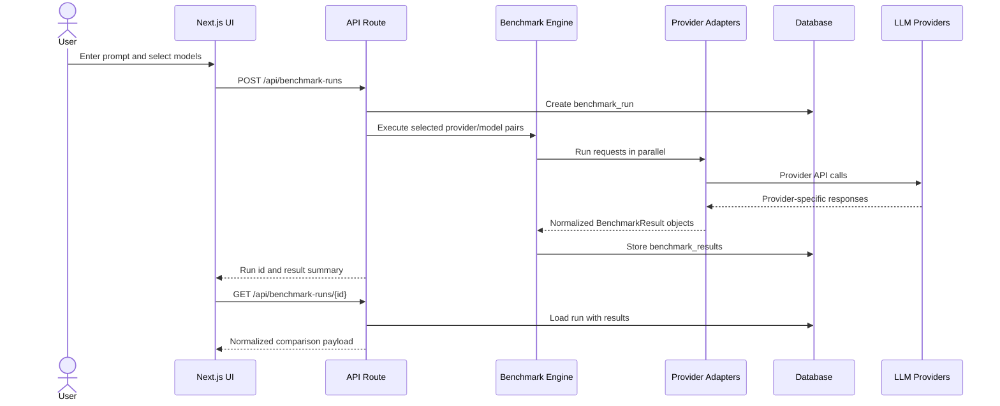
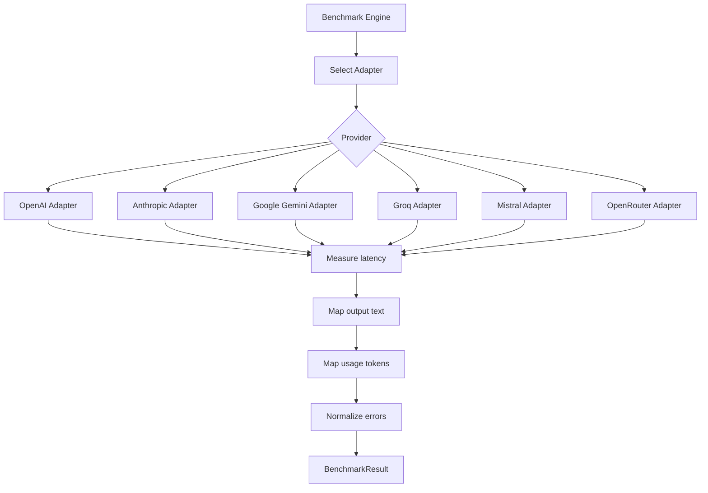
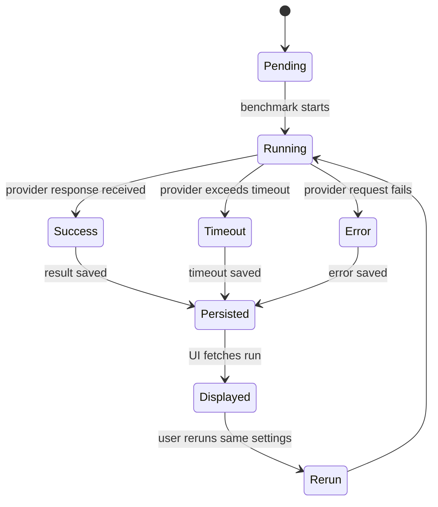
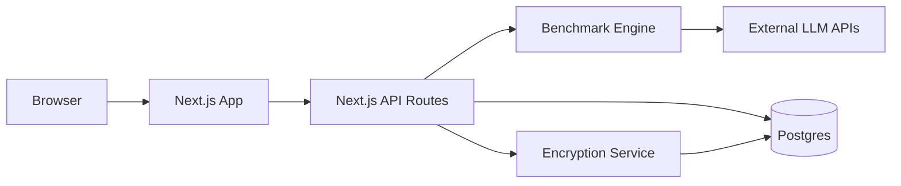

# Architecture Diagram

## Request Flow

## Provider Adapter Flow

## Result Lifecycle

## Deployment Shape

The application keeps provider API keys on the server. Browser code never receives raw API keys.

